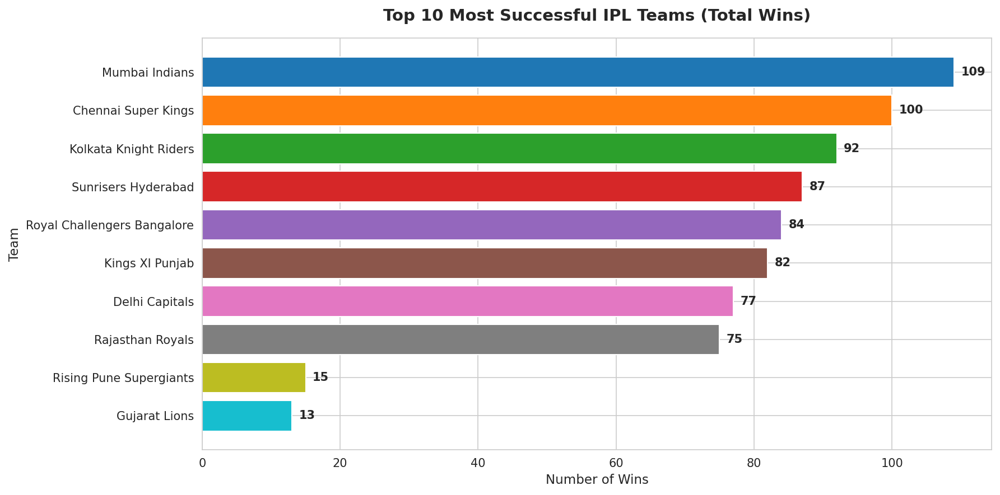
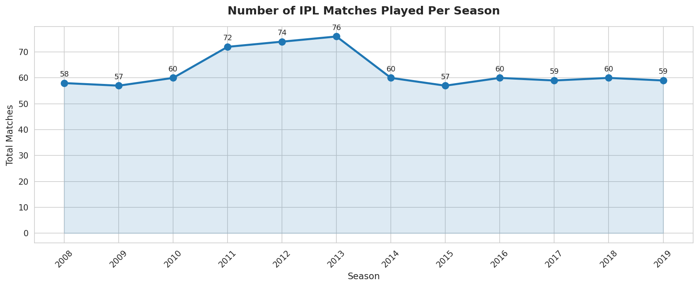
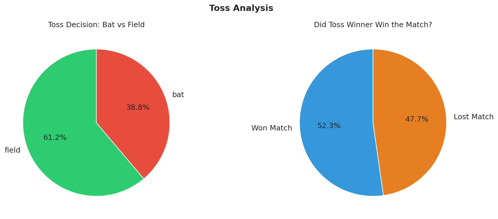
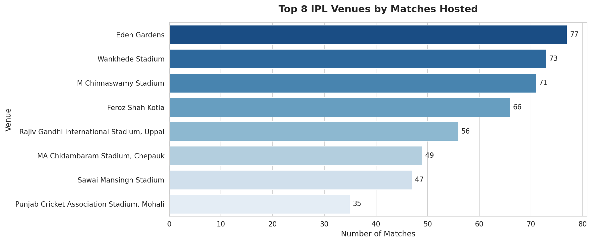
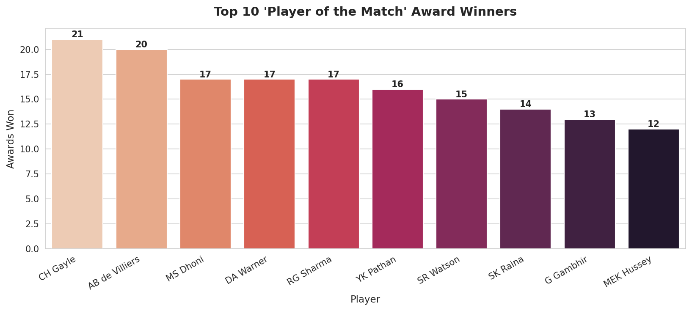
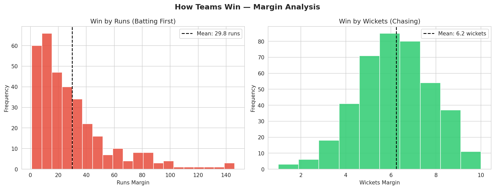
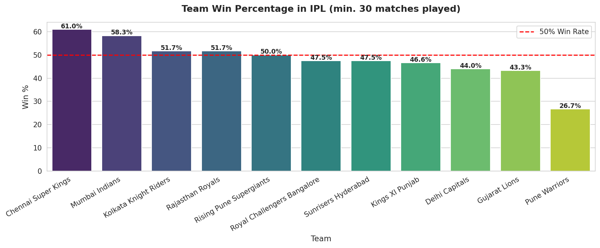

# 🏏 IPL Data Analysis & Visualization

An exploratory data analysis (EDA) project on Indian Premier League (IPL)
match data, uncovering patterns, trends, and insights using Python.

## 📌 Project Overview

This project performs a comprehensive analysis of IPL match data spanning
12 seasons (2008–2019). It answers key cricket analytics questions through
data cleaning, analysis, and 7 detailed visualizations.

**Key Questions Answered:**
- Which team has won the most IPL matches overall?
- How many matches were played each season?
- Do teams prefer to bat or field after winning the toss?
- Does winning the toss actually help win the match?
- Which venues host the most IPL games?
- Who are the most consistent performers (Player of the Match)?
- What is each team's overall win percentage?

## 🛠️ Tools & Technologies

| Tool | Purpose |
|------|---------|
| Python | Core programming language |
| Pandas | Data loading, cleaning & analysis |
| NumPy | Numerical computations |
| Matplotlib | Charts and plots |
| Seaborn | Statistical visualizations |

## 📂 Dataset

**IPL Matches Dataset**
- Source: [Kaggle — IPL Data](https://www.kaggle.com/datasets/nowke9/ipldata)
- File needed: `matches.csv`
- Records: 752 IPL matches
- Seasons: 2008 – 2019

### Key Columns

| Column | Description |
|--------|-------------|
| season | IPL season year |
| team1 / team2 | Competing teams |
| toss_winner | Team that won the toss |
| toss_decision | Chose to bat or field |
| winner | Match winner |
| win_by_runs | Margin if batting first won |
| win_by_wickets | Margin if chasing team won |
| player_of_match | Best performer |
| venue | Stadium where match was played |

## 🚀 How to Run

### 1. Clone this repository
```bash
git clone https://github.com/nimendragiri-lgtm/ipl-data-analysis.git
cd ipl-data-analysis
```

### 2. Install required libraries
```bash
pip install pandas numpy matplotlib seaborn
```

### 3. Download the dataset
- Go to [Kaggle IPL Dataset](https://www.kaggle.com/datasets/nowke9/ipldata)
- Download `matches.csv`
- Place it in the same folder as `ipl_analysis.py`

### 4. Run the project
```bash
python ipl_analysis.py
```

## 📊 Visualizations

### 1. Most Successful Teams


### 2. Matches Per Season


### 3. Toss Analysis


### 4. Top Venues


### 5. Player of the Match Leaders


### 6. Win Margins


### 7. Team Win Percentage


## 💡 Key Insights Found

- **Mumbai Indians** have the most wins overall (109 wins across 12 seasons)
- **Chennai Super Kings** lead in win percentage at 61.0% (among teams with 30+ matches)
- Teams choose to **field first 61.2%** of the time after winning the toss
- Winning the toss gives only a slight advantage — toss winners win just **52.3%** of matches
- **Eden Gardens** (77) and **Wankhede Stadium** (73) are the most used venues
- **CH Gayle** leads Player of the Match awards with 21
- Teams batting first win by an average of **29.8 runs**; chasing teams win by an average of **6.2 wickets**

## 💡 Key Learnings

- How to clean and standardise real-world messy data
- How to use Pandas groupby, value_counts, and filtering
- How to create multiple chart types for data storytelling
- How to extract meaningful insights from raw data
- How to structure a complete EDA project professionally

## 👤 Author

**Nimendra Giri**
- 📧 nimendragiri@gmail.com
- 🔗 [LinkedIn](https://www.linkedin.com/in/nimendra-giri-a00a31342)
- 🐙 [GitHub](https://github.com/nimendragiri-lgtm)
